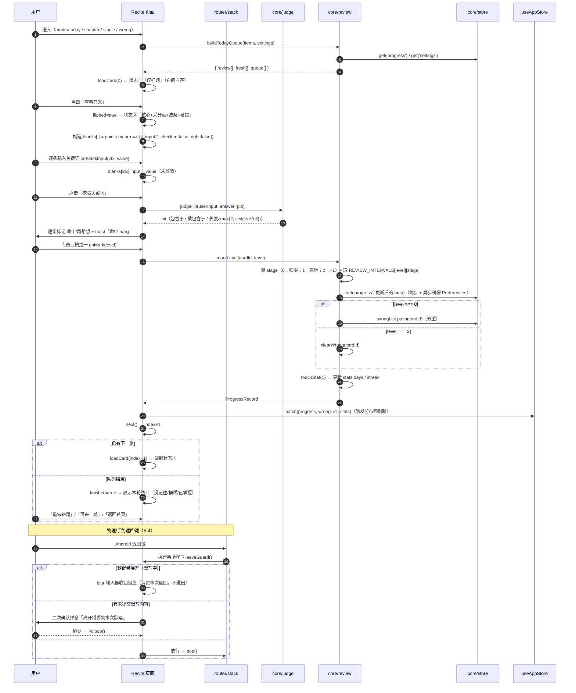
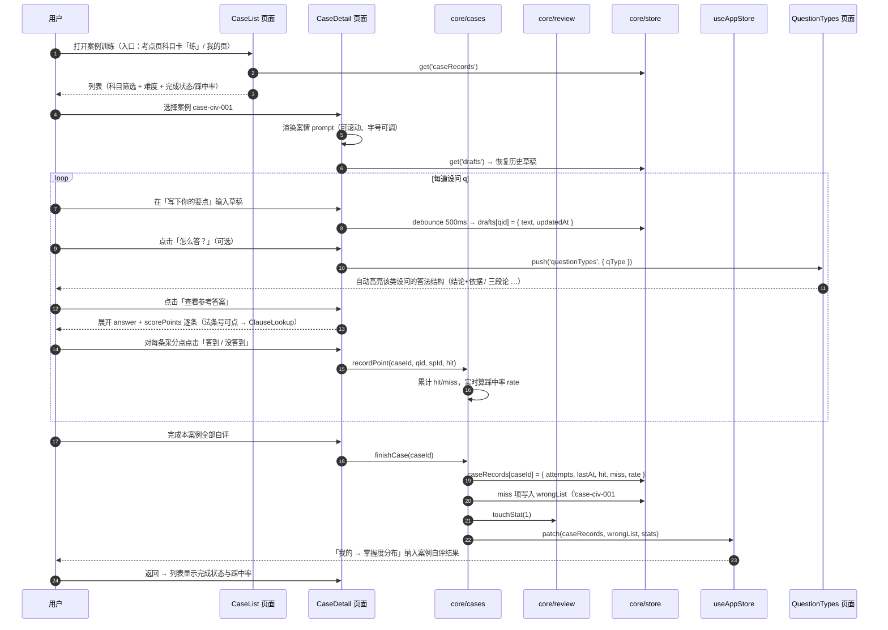
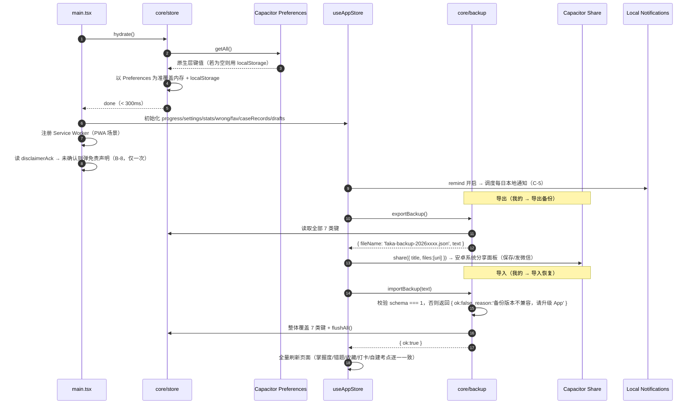

# 系统架构设计｜法考主观题速记 · Android 版

| 项目 | 内容 |
|---|---|
| 文档类型 | 系统架构设计 + 任务分解（基于 `docs/PRD-android.md` v1.0） |
| 架构师 | 高见远（software-architect） |
| 工程根目录（Web 应用） | `C:/Users/1/WorkBuddy/2026-09-26-00-16-50/faka-miniapp/faka-android/` |
| Git 仓库根目录（Actions 必须在此） | `C:/Users/1/WorkBuddy/2026-09-26-00-16-50/faka-miniapp/`（含 `.github/workflows/`） |
| 目标平台 | Android 8.0（API 26）+，竖屏，完全离线 |
| 合规基线 | 第三方付费讲义**只做结构化提炼为自有表述**，不落原文；考试日期/分值一律标注"以司法部官方公告为准" |

---

## 0. 结论摘要（先看这段）

| # | 决策 | 结论 |
|---|---|---|
| 1 | APK 出包主路线 | **① Capacitor 7 + GitHub Actions 云构建**（本机零工具链；我们把 `android/` 原生壳与 `dist/` 一并生成并 commit，CI 只跑 `gradlew assembleDebug`） |
| 2 | PWA 兜底 | **必须交付**（同一份 `dist/`，零额外成本；提供 GitHub Pages / 局域网预览 / 单文件离线包三种可达路径） |
| 3 | uni-app 路线 | **否决**（我们无法本地验证、强依赖 HBuilderX GUI 与 DCloud 账号、产物不能复用为 PWA；详见 1.3） |
| 4 | 双端数据（Q7） | `miniprogram/data` 保持唯一手改源 → `tools/gen-shared.mjs` 生成 ESM 到 `shared/` → 安卓 import；新增内容直接写在 `shared/data/`（ESM） |
| 5 | 存储（C-3） | 双层：`localStorage`（同步，保证 `get/set/remove` 签名不变）+ Capacitor Preferences（异步镜像，防 WebView 缓存清理）；启动 `hydrate()` 合并 |
| 6 | 单位方案（无 rpx） | CSS 变量 `--rpx: calc(100vw / 375)`，Tailwind `spacing/fontSize` 全部改为 `calc(var(--rpx) * N)` |
| 7 | 任务批次 | 5 个主任务（T01–T05），每个含 3–5 个子步骤，可按子步骤分批交付 |

---

## 1. 技术选型结论

### 1.1 三条出包路线对比

| 维度 | ① Capacitor 7 + GitHub Actions | ② uni-app + HBuilderX 云打包 | ③ PWA（SW + Manifest） |
|---|---|---|---|
| **本机是否需要新工具链** | 否（Node 即可；`npx cap add android` 只做模板拷贝） | 是（下载安装 HBuilderX ≈ 200MB，且必须用它的 GUI 点"云打包"） | 否 |
| **用户操作步骤** | ① 注册 GitHub → ② 建空仓库 → ③ 我们给的 `git init/push` 一条命令（或 GitHub Desktop 拖）→ ④ Actions → Run workflow → ⑤ 下载 Artifact | ① 装 HBuilderX → ② 登录 DCloud 账号 → ③ 导入工程 → ④ 发行→原生 App 云打包 → ⑤ 等排队后下载 | ① 打开网址 → ② 添加到主屏幕（**当场可用**） |
| **是否需要账号** | GitHub 账号 | DCloud 账号（+可能的实名/额度限制） | 无（局域网预览方案连托管都不需要） |
| **改造成本** | 页面需重写为 React/JSX；`data/`、`constants`、`util`、`review` 算法 100% 复用；`wx.*` → 少量 Capacitor 插件 | `wx.*` → `uni.*`（API 名几乎一致，**迁移最省**）、wxml→Vue 模板相似度高、rpx 原生可用；但页面同样要重写为 Vue SFC | 与 ① 同一份产物，零增量成本 |
| **我们能否本地验证** | ✅ 能：`vite build` + 冒烟测试 + 生成 `android/` 后校验产物结构 | ❌ 不能：本机无 HBuilderX，工程能否被 HBuilderX 识别/打包只能靠用户试错，来回成本极高 | ✅ 能 |
| **产物复用性** | 高：`dist/` 是标准静态站 → 可做 PWA、可被任意第三方云打包服务吃下 | 低：产物与 DCloud 绑定 | — |
| **失败模式** | 构建失败可在 Actions 日志定位并重跑；单次构建 ≈ 6–10 分钟 | 云打包失败原因黑盒（appid/证书/权限/HBuilderX 版本），用户需反复操作 GUI | 几乎不会失败 |
| **产物形态** | ✅ 真 APK（debug 签名，可直接安装） | ✅ 真 APK | ❌ 不是 APK（桌面图标 + 全屏 + 离线，但非文件形态） |
| **网络可达性风险（中国大陆）** | 中：github.com 访问/下载 Artifact 可能慢或失败 | 低：dcloud.io 为国内服务 | 低 |

### 1.2 最终选择：① Capacitor 7 + GitHub Actions（主路线）+ ③ PWA（强制兜底）

**选 ① 的三个决定性理由：**

1. **"我们能验证到什么程度"决定用户试错次数。** 这是本次最关键的一条。选 ① 时，我们可以在本机把 Web 产物、`android/` 原生壳、图标、Manifest、workflow YAML 全部生成并静态校验完，用户那边只剩"push + 点按钮"；选 ② 时，我们对 HBuilderX 侧完全盲盒，任何 manifest 配置或版本不兼容都要用户反复点 GUI 试错——对一位非开发者的考生来说是灾难。
2. **产物可复用，兜底路径最多。** `dist/` 是标准静态站：既能进 Capacitor 壳出 APK，也能直接做 PWA，还能交给任意第三方云打包服务。等于"一份代码、三条出包路径"，用户任一条走通就有结果。
3. **Actions 构建确定性强。** 我们进一步把 `android/`（Capacitor 原生壳，含 Gradle Wrapper）与构建好的 `dist/` 一并 commit，workflow 里**不跑 `cap add`、不跑 npm build**，只做 `npx cap copy android` + `./gradlew :app:assembleDebug`，把 CI 的失败面缩到最小。GitHub 托管 Runner 自带 JDK 17 与 Android SDK（`android-actions/setup-android` 兜底），这条路径业界成熟。

**为什么 PWA 兜底必须一起交付：** 它是唯一"零账号、零审核、当场可用"的路径，且成本近乎为零（复用同一份 `dist/`，额外只多 `manifest.webmanifest` + `sw.js` 两个文件，约 80 行）。用户在 GitHub 拿不到 APK 的当天，就能用手机把 App 装到桌面并离线使用，实质诉求（装到手机、有图标、离线）已满足。**三条可达路径**按优先级写在 `docs/APK-出包指南.md`：
- P1：GitHub Pages（若用户有 GitHub）——`main` 分支 `docs/` 或 `gh-pages` 分支托管 `dist/`
- P2：**局域网预览（零托管）**——本机 `npm run preview -- --host` → 手机同 WiFi 打开 `http://192.168.x.x:4173` → Chrome「添加到主屏幕」→ Service Worker 已缓存全部资源 → 之后断网可用
- P3：**单文件离线包**——`dist/` 内联为单个 `faka-offline.html`（`vite build` + 内联插件或手写内联脚本），通过微信/USB 传到手机，用浏览器打开即可离线使用（无桌面图标，属最后兜底）

### 1.3 否决 ② uni-app + HBuilderX 云打包的原因（明确记录，不是"没考虑"）

- 改造成本优势**被高估**：uni-app 真正的省事点只有两处（`wx.*`→`uni.*` 同名替换、rpx 原生可用）。但 `Page({data, setData})` → Vue 组件响应式、`wx:for` → `v-for`、页面路由与生命周期仍是完整重写，与写 React 的工程量是同一量级。
- 交付链路**不可验证**：本机没有也不能装 HBuilderX，我们产出的 `manifest.json` / `pages.json` 是否正确、云打包能否通过，只能靠用户反馈；而用户每试一次都要走一遍 GUI + 云打包排队（分钟级）。
- 强依赖第三方 GUI 与账号：需下载 ≈200MB IDE、注册 DCloud 账号、受免费额度/排队影响；且 uni-app App 端产物无法直接复用为 PWA。
- **未完全放弃**：在 `docs/APK-出包指南.md` 中给出"若 GitHub 完全不可用"的 HBuilderX 云打包操作指引（P2 文档级兜底），但**本次不实现 uni-app 工程**。

### 1.4 明确不交付的形态

> ❌ 只给一个 `android/` 目录 + "请先安装 JDK 17 和 Android SDK"。
> 本设计中用户**全程不需要在本机安装任何编译工具链**。若 Actions 首次运行失败，工程内提供 `docs/APK-出包指南.md` 的"常见失败与处理"清单；仍不可行时必须上报 team-lead，不得静默降级。

### 1.5 其余技术选型

| 项 | 选型 | 理由 |
|---|---|---|
| 构建 | Vite 5 + TypeScript 5 | 纯 JS 工具链（esbuild 为预编译二进制，不需本机编译），构建 <20s，产物小 |
| UI 框架 | React 18 | 组件化清晰、生态稳定；不用 Next（需要 SSR/Node 服务端，离线 App 不需要） |
| 样式 | Tailwind CSS 3 + PostCSS | 原子类，无运行时；通过 theme 改造实现 rpx 等价（见 §9.4） |
| 状态管理 | Zustand 4 | ~1KB，无 Provider 嵌套，避免 Context 全量重渲染；不引入 Redux |
| 路由 | **自建轻量页面栈**（hash + 数组栈，约 120 行） | PRD A-4 要求精确的"页面栈 + 返回拦截"语义（默写中先收键盘），react-router 无法直接给出栈深度与离场拦截；自建反而更简单可控 |
| 原生桥 | Capacitor 7 + `@capacitor/app`（返回键/退出）`preferences`（持久化）`status-bar`（沉浸式）`share`（系统分享）`local-notifications`（每日提醒） | 覆盖 A-3/A-4/C-2/C-5/C-6，全部纯 JS API |
| 图标纹理 | Python 标准库 PNG 写入器（复用 `tools/gen_icons.py` 的 Canvas，纯几何图形，无字体依赖） | 本机无 PIL/sharp，纯 `zlib+struct` 可写 PNG；避免引入 sharp 这类带原生二进制的依赖 |
| 自测 | Node 脚本 `tools/smoke-test-android.mjs`（无框架） | 与现有 `tools/smoke-test.js`（PASS 25）对齐，等价迁移 + 新增项 |

---

## 2. 实现方案与工程结构

### 2.1 根目录选址理由

Web 应用放在 **`faka-miniapp/faka-android/`**（与 `miniprogram/` 平级），**不放** `faka-miniapp/android/`：

1. `android/` 这个名字会被 Capacitor 生成的原生壳占用（`faka-android/android/`），放外层会导致 `android/android` 双重歧义；
2. 与 `miniprogram/` 平级，直观表达"两个端、一份数据"；
3. Git 仓库根仍在 `faka-miniapp/`（GitHub Actions 要求 `.github/workflows/` 位于仓库根），不破坏现有仓库结构。

### 2.2 完整目录树

```
faka-miniapp/                                  ← Git 仓库根（Actions 在这里）
├── .github/
│   └── workflows/
│       └── build-apk.yml                      ★ 云构建 APK：检出 → JDK17 → cap copy → gradlew assembleDebug → 上传 Artifact
├── .gitignore                                 新增：忽略 node_modules、raw/（PDF 抽取中间产物）、dist 可选
│
├── miniprogram/                               【不动】微信小程序端（唯一手改的考点数据源）
│   └── data/*.js                              88 卡 + 8 模板，保持 CommonJS
│
├── shared/                                    ★ 新增：双端共享单一数据源（ESM）
│   ├── data/
│   │   ├── study-rule-law.js … study-commercial.js   【生成物】由 tools/gen-shared.mjs 产出，勿手改
│   │   ├── essay-templates.js                 【生成物】8 套论述模板
│   │   ├── mnemonics-crim-proc.js             【手写】B-1 刑诉口诀卡 ≥60 条
│   │   ├── cases-civil.js                     【手写】B-3 民法案例（张翔采分有料提炼）
│   │   ├── cases-crim-proc.js                 【手写】B-3 刑诉小案例/真金题提炼
│   │   ├── cases-rule-law.js                  【手写】B-3 法治思想案例（≥3 科）
│   │   ├── question-types.js                  【手写】B-4 六类设问答题模板
│   │   └── clause-index.js                    【生成物】B-2 法条号 → 卡片/口诀/案例 反向索引
│   ├── constants.js                           【生成物】SUBJECTS/LEVELS/MASTERY/REVIEW_INTERVALS/STORAGE_KEYS
│   ├── util.js                                【生成物】日期/洗牌（去掉 wx.toast）
│   ├── review-algo.js                         【生成物】纯算法：算 stage/due、队列筛选，不依赖存储
│   └── types.d.ts                             共享数据的 JSDoc 类型提示（可选，供 TS 校验）
│
├── faka-android/                              ★ 新增：Android Web 应用工程（本次主战场）
│   ├── package.json                           依赖与脚本（dev/build/preview/cap:sync/test）
│   ├── vite.config.ts                         base:'./'、构建产物 dist/、路径别名 @ → src
│   ├── tsconfig.json / tsconfig.node.json     严格模式、@ 别名
│   ├── tailwind.config.js                     ★ rpx 等价改造：spacing/fontSize 走 calc(var(--rpx)*N)
│   ├── postcss.config.js                      tailwindcss + autoprefixer
│   ├── capacitor.config.ts                    appId/appName/webDir/plugins 配置
│   ├── index.html                             viewport-fit=cover、theme-color、竖屏 meta
│   ├── public/
│   │   ├── manifest.webmanifest               PWA 清单（name/icons/display:standalone/orientation:portrait）
│   │   ├── sw.js                              手写 Service Worker：同源 GET cache-first（离线）
│   │   └── icon-192.png / icon-512.png        PWA 图标（由 tools 生成）
│   ├── src/
│   │   ├── main.tsx                           入口：hydrate() → 注册 SW → 挂载 App
│   │   ├── App.tsx                            根组件：NavHost + TabBar + 首次启动免责弹窗 + 返回键监听
│   │   ├── types/index.ts                     ★ 全局 TS 数据契约（见 §4）
│   │   ├── router/
│   │   │   ├── routes.ts                      路由名 → 页面组件 + Tab 归属声明
│   │   │   ├── stack.ts                       ★ 页面栈内核：push/pop/popTo/switchTab/reset + 离场守卫
│   │   │   └── NavHost.tsx                    渲染栈顶页面（保留栈内实例，切 Tab 不丢栈）
│   │   ├── core/
│   │   │   ├── store.ts                       ★ 双层持久化（localStorage 同步 + Preferences 异步镜像）
│   │   │   ├── review.ts                      复习引擎（等价迁移 utils/review.js）
│   │   │   ├── judge.ts                       默写命中判定（规则与小程序逐字一致）
│   │   │   ├── search.ts                      全文检索（考点/口诀/案例/模板/法条号）
│   │   │   ├── clause.ts                      法条号归一化与反查（"刑诉法 16" → 条目）
│   │   │   ├── cases.ts                      案例训练自评与错题回流
│   │   │   └── backup.ts                      C-2 导出/导入 JSON（schema 版本校验）
│   │   ├── state/useAppStore.ts               Zustand：progress/settings/stats/wrong/fav/caseRecords/drafts
│   │   ├── hooks/
│   │   │   ├── useSafeArea.ts                 ★ 安全区探测（env() 不可用时 JS 兜底测量）
│   │   │   ├── useBackButton.ts               Capacitor appBackButton → router.pop()
│   │   │   └── useKeyboard.ts                 软键盘开合探测（默写返回拦截用）
│   │   ├── components/                        通用 UI（见 §6.3）
│   │   ├── pages/                             页面（见 §6.1）
│   │   ├── styles/
│   │   │   ├── index.css                      Tailwind 指令 + CSS 变量 + 深色模式 + 字体缩放
│   │   │   └── scale.css                      --rpx / --safe-top / --safe-bottom / 触摸目标基线
│   │   └── utils/
│   │       ├── date.ts                        日期归一化（due 存本地当天 00:00 时间戳）
│   │       └── toast.ts                       轻量提示（替代 wx.showToast）
│   ├── dist/                                  ★ 构建产物，**不 gitignore**，commit 进仓库供 CI 直接 copy
│   └── android/                               ★ Capacitor 原生壳，commit 进仓库（CI 不再 cap add）
│       ├── build.gradle / settings.gradle / gradlew / gradle/wrapper
│       └── app/
│           ├── build.gradle                   applicationId/versionCode/versionName
│           └── src/main/
│               ├── AndroidManifest.xml        ★ 改：竖屏锁定、adjustResize、删除 INTERNET 权限
│               └── res/
│                   ├── values/strings.xml     应用名「法考主观题速记」
│                   └── mipmap-*/ic_launcher*.png   ★ 由 tools/gen-icons-android.py 生成
│
├── tools/
│   ├── gen-shared.mjs                         ★ 小程序 CJS 数据 → shared/ ESM（module.exports → export default）
│   ├── gen-clause-index.mjs                   ★ 从口诀/案例/卡片扫描法条号 → clause-index.js
│   ├── extract-pdf.py                         ★ PDF 结构化抽取（指定 Python 解释器，见 T03）
│   ├── gen-icons-android.py                   ★ 安卓多密度图标（纯标准库，几何图形，无字体依赖）
│   ├── smoke-test.js                          【不动】小程序端 25 项自测
│   └── smoke-test-android.mjs                 ★ 安卓等价自测 ≥25 项 + 新增项（目标 PASS ≥35 / FAIL 0）
│
├── raw/                                       PDF 抽取中间产物（**gitignore，绝不入库**，合规红线）
└── docs/
    ├── PRD-android.md
    ├── ARCH-android.md                        本文件
    ├── content-gap.md                         B-7 对账表（四科）
    └── APK-出包指南.md                        ★ 用户 3 步出包 + 失败处理 + PWA 兜底三条路径
```

---

## 3. 文件清单

> 行数区间为预估，含注释；`【生成物】` 表示由脚本产出，工程师不手改。

### 3.1 配置与入口（T01）

| 相对路径 | 职责 | 行数 |
|---|---|---|
| `faka-android/package.json` | 依赖声明 + scripts（dev/build/preview/cap:sync/cap:copy/test） | 40–60 |
| `faka-android/vite.config.ts` | base `'./'`、alias `@`→src、build.outDir `dist` | 20–30 |
| `faka-android/tsconfig.json` | strict、jsx react-jsx、paths 别名 | 25–35 |
| `faka-android/tailwind.config.js` | **rpx 等价改造**（spacing/fontSize 生成器）+ 主题色 + darkMode 'class' | 60–90 |
| `faka-android/postcss.config.js` | tailwindcss + autoprefixer | 6–10 |
| `faka-android/capacitor.config.ts` | appId `com.faka.zhuguan`、appName「法考主观题速记」、webDir `dist`、StatusBar overlay | 20–30 |
| `faka-android/index.html` | `viewport-fit=cover`、theme-color、SW 注册前置、`#root` | 20–30 |
| `faka-android/src/main.tsx` | 启动序列：`store.hydrate()` → 状态初始化 → 注册 SW → render | 30–50 |
| `faka-android/src/App.tsx` | NavHost + TabBar + 首次免责弹窗 + 全局返回键 + 深/浅色 | 120–180 |
| `faka-android/src/types/index.ts` | ★ 全部数据契约（§4） | 150–220 |
| `faka-android/src/styles/index.css` | Tailwind 指令、CSS 变量、深色模式、fontScale | 80–120 |
| `faka-android/src/styles/scale.css` | `--rpx`/`--safe-*`/触摸目标基线/安全区工具类 | 60–90 |
| `.gitignore` | node_modules、`raw/`、`.DS_Store`（**dist 与 android 不忽略**） | 10–20 |

### 3.2 核心层（T02）

| 相对路径 | 职责 | 行数 |
|---|---|---|
| `src/core/store.ts` | ★ `get/set/remove` 同步签名 + `hydrate()` + Preferences 异步镜像 + 读写失败兜底 | 120–160 |
| `src/core/review.ts` | 复习引擎：markLevel/clearWrong/dueCards/newCards/buildTodayQueue/levelStats/touchStat/收藏/设置/自建卡 | 220–280 |
| `src/core/judge.ts` | 默写命中判定（与小程序 `onCheckAll` 规则逐字等价） | 30–50 |
| `src/core/search.ts` | 五类分组检索 + 法条号直达 + 搜索历史 | 120–160 |
| `src/core/clause.ts` | 法条号归一化（`《刑事诉讼法》第16条` ↔ `刑诉法16`）+ 反查 | 70–100 |
| `src/core/cases.ts` | 案例自评写盘、踩中率、未答到采分点回流错题本 | 80–120 |
| `src/core/backup.ts` | 导出/导入 JSON（schema 校验 + 版本不兼容明确报错） | 100–140 |
| `src/router/routes.ts` | 路由表：name → 组件 + 是否 Tab 根 + 标题 | 60–90 |
| `src/router/stack.ts` | ★ 页面栈内核（每 Tab 独立栈、push/pop/popTo/switchTab/reset、离场守卫） | 130–180 |
| `src/router/NavHost.tsx` | 栈顶渲染 + 转场动画 + 离场守卫执行 | 80–120 |
| `src/state/useAppStore.ts` | Zustand 全局状态与 actions | 150–200 |
| `src/hooks/useSafeArea.ts` | 安全区探测（`env()` + JS 兜底测量） | 40–60 |
| `src/hooks/useBackButton.ts` | Capacitor `appBackButton` → 栈 pop / 双击退出 | 50–70 |
| `src/hooks/useKeyboard.ts` | 软键盘开合探测（默写返回拦截） | 40–60 |
| `src/utils/date.ts` | `todayStart/daysLater/dayDiff/formatDate/daysUntil` | 40–60 |
| `src/utils/toast.ts` | 提示浮层（替代 `wx.showToast`） | 30–50 |

### 3.3 共享数据与内容（T01.2 / T03）

| 相对路径 | 职责 | 行数 |
|---|---|---|
| `tools/gen-shared.mjs` | ★ 读 `miniprogram/data/*.js` + `utils/constants.js|util.js`，`module.exports` → `export default`，输出到 `shared/` | 90–130 |
| `tools/gen-clause-index.mjs` | 扫描全部卡/口诀/案例的 `clauses|clauseIndex` → 生成 `shared/data/clause-index.js` | 80–120 |
| `tools/extract-pdf.py` | pypdf 分页抽取 5 份 PDF → `raw/*.json`（结构化候选，供人工/脚本提炼） | 150–220 |
| `tools/gen-icons-android.py` | 纯标准库生成 mipmap 5 密度图标（几何图形） | 120–180 |
| `shared/data/study-*.js`（7 个） | 【生成物】88 张考点卡 | 同原文件 |
| `shared/data/essay-templates.js` | 【生成物】8 套论述模板 | 207 |
| `shared/constants.js` `util.js` `review-algo.js` | 【生成物】 | 65/70/60 |
| `shared/data/mnemonics-crim-proc.js` | 【手写】B-1 刑诉口诀 ≥60 条 | 400–600 |
| `shared/data/cases-civil.js` | 【手写】B-3 民法案例 ≥10 问 | 250–400 |
| `shared/data/cases-crim-proc.js` | 【手写】B-3 刑诉案例 ≥12 问 | 250–400 |
| `shared/data/cases-rule-law.js` | 【手写】B-3 法治思想案例 ≥8 问 | 180–300 |
| `shared/data/question-types.js` | 【手写】B-4 六类设问模板 | 120–180 |
| `shared/data/clause-index.js` | 【生成物】B-2 法条索引 | 200–400 |
| `docs/content-gap.md` | B-7 四科对账表 | 80–150 |

### 3.4 页面与组件（T04 / T05）

| 相对路径 | 职责 | 行数 |
|---|---|---|
| `src/pages/Home.tsx` | P1 考点首页：倒计时/今日任务/打卡/二级 Tab（考点·论述）/七科网格/S 级速览 | 200–280 |
| `src/pages/Chapter.tsx` | 章节列表（科目内，按 level 过滤、整章开背） | 120–160 |
| `src/pages/Review.tsx` | P2 背诵台：今日/错题/收藏/全部 四 Tab + 新学上限入口 | 150–200 |
| `src/pages/Recite.tsx` | ★ P3 背诵卡：三态状态机 + 采分点默写 + 三档掌握度 + 返回拦截（**最复杂**） | 320–420 |
| `src/pages/Search.tsx` | P9 全文检索（五分组 + 法条号直达 + 历史） | 150–200 |
| `src/pages/EssayList.tsx` | 论述模板列表（首页二级 Tab 内） | 90–130 |
| `src/pages/EssayDetail.tsx` | P7 论述详情：框架/金句/槽位/示范/失分点/草稿 | 220–300 |
| `src/pages/Mnemonic.tsx` | ★ P4 口诀：科目筛选（仅刑诉可选）+ 口诀列表 | 120–160 |
| `src/pages/CaseList.tsx` | ★ P5 案例训练列表：科目筛选 + 完成状态 | 110–150 |
| `src/pages/CaseDetail.tsx` | ★ P5 案例详情：案情 → 设问 → 草稿 → 答案 → 逐条自评 | 260–340 |
| `src/pages/QuestionTypes.tsx` | P6 六类设问模板（支持从案例跳转并高亮） | 120–160 |
| `src/pages/ClauseLookup.tsx` | B-2 法条速查：条号 → 关联卡片/口诀/案例 | 100–140 |
| `src/pages/Mine.tsx` | P8 我的：掌握度分布 + 近 7 天柱状图 + 入口 | 180–240 |
| `src/pages/Settings.tsx` | 设置：新学上限/考试日期/提醒/深色/字号/备份 | 180–240 |
| `src/pages/About.tsx` | B-8 关于与免责声明 + 版本号 | 80–120 |
| `src/pages/WrongBook.tsx` | 错题本（含案例采分点回流项） | 110–150 |
| `src/pages/Favorites.tsx` | 收藏列表（四类分组） | 100–140 |
| `src/pages/UserCards.tsx` | 自建考点增删改 | 150–200 |
| `src/components/*.tsx`（14 个） | 见 §6.3 | 各 30–90 |

### 3.5 原生壳与交付（T05.4 / T05.5）

| 相对路径 | 职责 | 行数 |
|---|---|---|
| `.github/workflows/build-apk.yml` | ★ 云构建（见 §8.2 完整设计） | 50–70 |
| `faka-android/android/**` | Capacitor 原生壳（生成后手工改 4 处，见 §8.3） | 生成物 |
| `public/manifest.webmanifest` | PWA 清单 | 25–35 |
| `public/sw.js` | Service Worker（同源 GET cache-first） | 50–80 |
| `docs/APK-出包指南.md` | 用户 3 步出包 + 失败处理 + PWA 三条兜底路径 | 120–180 |

---

## 4. 数据结构定义（重点）

> 全部定义落在 `faka-android/src/types/index.ts`，`shared/data/*` 用 JSDoc 注释对齐。

### 4.1 统一卡片判别与"复习项"

```ts
/** 卡片种类：考点(原有) / 口诀(B-1) / 案例(B-3) */
export type CardKind = 'card' | 'mnemonic' | 'case';

/** 采分点（默写挖空的是 k，展开说明是 v） */
export interface Point { k: string; v: string }

/** 重要度 */
export type Level = 'S' | 'A' | 'B' | 'C';

/** 复习项：进度/错题/收藏/队列统一按 id 索引，id 全局唯一且带种类前缀 */
export interface ReviewItem {
  id: string;                 // 见 §9.1 id 命名规范
  kind: CardKind;
  subject: string;            // SUBJECTS 的 id，如 'crim-proc'
  chapter: string;            // 章节名（同名字自动归组）
  level: Level;
  /** 正面主标题：考点=title，口诀=mnemonic，案例=title */
  primary: string;
  /** 副标题：考点=core，口诀=scenario，案例=prompt 摘要 */
  secondary: string;
  /** 默写/自评用的采分点：考点=points，口诀=points，案例=null（案例用 questions 自评） */
  points: Point[] | null;
  clauses: string[];          // 法条依据（考点沿用 clauses；口诀/案例用 clauseIndex 合并而来）
}
```

**迁移方式（零风险）**：88 张考点卡的**源文件一个字不改**，在 `src/core/catalog.ts`（由 `shared/data` 装配）里做一次运行期归一化——注入 `kind:'card'`、`subject`、`primary=title`、`secondary=core`。

### 4.2 考点卡（原有 88 张，迁移）

```ts
/** 小程序原有结构（miniprogram/data/*.js），保持不动 */
export interface LegacyCard {
  id: string;            // 'crimpro-01'
  chapter: string;
  title: string;
  level: Level;
  core: string;
  points: Point[];       // 至少 1 项，k/v 均非空
  clauses: string[];     // ['《刑事诉讼法》第7条']
  trick: string;
  essay?: boolean;
}
/** 装配后（新增字段，原字段原样保留） */
export interface CardItem extends LegacyCard {
  kind: 'card';
  subject: string; subjectName: string; subjectShort: string; subjectColor: string;
}
```

冒烟测试必须等价保留原有 8 项必填校验（id 唯一 / 字段齐全 / points 非空 / level 合法 等）。

### 4.3 口诀卡（B-1，新增）

```ts
/** 口诀卡 — 相对 PRD 的微调：clauseIndex 由 string 改为 string[]，理由见 §4.3.1 */
export interface MnemonicCard {
  id: string;             // 'mn-crimpro-003'
  kind: 'mnemonic';       // 判别字段
  subject: string;        // 'crim-proc'（首批仅刑诉）
  chapter: string;        // '法定不追诉情形'
  mnemonic: string;       // 口诀短句：'显著轻、过时效、特赦、告诉和死掉'（卡片正面大字）
  scenario: string;       // 适用情形标题：'法定不追究刑事责任的六种情形'（副标题）
  points: Point[];        // 展开：每条情形 {k:'情形关键词', v:'展开表述'}（翻面 + 默写用）
  clauseIndex: string[];  // ['《刑事诉讼法》第16条']（法条号，可点 → B-2 速查）
  level: Level;
  tip?: string;           // 易错提示（可选）
  sourceNote?: string;    // 合规标注（可选，默认走全局免责声明常量）
}
```

**4.3.1 对 PRD 字段的两处微调（需 team-lead 知悉）**
1. `clauseIndex: string` → `string[]`：向高甲口诀一条常引多条规定（如《刑诉法》第 16 条 +《刑诉解释》第 x 条），用数组避免二次拆分，渲染时 `join('、')`，B-2 索引构建直接遍历。**若坚持用单 string，多条时以 `；` 分隔并在 clause.ts 内 split**——我推荐数组。
2. 新增可选 `tip`：部分口诀有"四阶段处理不同"这类易错点，复用考点卡的 `trick` 语义。

### 4.4 案例训练（B-3，新增）

```ts
/** 六类设问（B-4） */
export type QuestionType = 'relief' | 'plan' | 'evaluate' | 'correct' | 'essay' | 'open';

/** 一个采分点 */
export interface ScorePoint {
  id: string;        // 'sp-1'，案例内唯一（进错题本时用复合 id，见 §4.6）
  k: string;         // 采分关键词（自评按钮旁展示）
  v?: string;        // 展开表述（可选）
}

/** 一道设问 */
export interface CaseQuestion {
  qid: string;             // 'case-civ-001-q1'，全局唯一
  q: string;               // 设问原文（自有表述）
  qType?: QuestionType;    // 关联 B-4，支持「怎么答？」跳转并高亮
  answer: string;          // 参考答案（自有表述）
  scorePoints: ScorePoint[]; // ≥1 条
  clauseIndex?: string[];   // 本问涉及的法条号（可点）
}

/** 案例卡 */
export interface CaseCard {
  id: string;          // 'case-civ-001'
  kind: 'case';
  subject: string;     // 'civil'（首批覆盖民法/刑诉/法治思想 ≥3 科）
  chapter: string;     // '房屋租赁纠纷'
  title: string;       // ★ PRD 结构里没有 title，但列表页必须有标题，故补（可用"案例1·房屋租赁"）
  level: Level;
  prompt: string;      // 案情（长文本，支持字号调节）
  questions: CaseQuestion[]; // ≥1 问；首批总量 ≥30 问
}

/** 案例训练记录（持久化） */
export interface CaseRecord {
  caseId: string;
  attempts: number;         // 做过几轮
  lastAt: number;           // 最近一次时间戳
  hit: string[];            // 命中的 ScorePoint 复合 id
  miss: string[];           // 未答到（回流错题本）
  rate: number;             // 最近一次踩中率 0–1，计入「我的 → 掌握度分布」
}
```

**4.4.1 对 PRD 的两处补充**：`title`（列表展示必需）与 `qType`（B-4 跳转必需）。二者均可从资料自然提炼。

### 4.5 法条索引（B-2）

```ts
export interface ClauseEntry {
  code: string;        // 归一化键：'刑事诉讼法|16'（见 core/clause.ts normalize）
  label: string;       // 展示：'《刑事诉讼法》第16条'
  law: string;         // '刑事诉讼法'
  article: string;     // '16'
  refs: string[];      // 关联的卡片/口诀/案例 id（双向跳转的反查来源）
}
/** 输入「刑诉法 16」「刑事诉讼法第十六条」→ 命中 code */
export function normalizeClause(input: string): string | null;
```

### 4.6 存储层数据结构

> 存储 key 沿用小程序 `fk_*` 前缀（**保证导入导出与小程序兼容**），新增 3 个 key。

```ts
/** 单卡进度：与小程序完全一致，新增案例按同一结构存 */
export interface ProgressRecord {
  level: -1 | 0 | 1 | 2;  // -1 未学 / 0 没记住 / 1 模糊 / 2 记住了
  stage: number;          // 间隔数组下标
  due: number;            // 下次到期时间戳（本地当天 00:00）
  lastAt: number;
  wrong: number;
  seen: number;
}
export type ProgressMap = Record<string, ProgressRecord>;   // key = 卡片 id（全局唯一，不额外存 kind）

export interface Settings {
  dailyNew: number;        // 默认 20
  dailyReview: number;     // 默认 60
  showKeywordTip: boolean; // 默认 true
  examDate: number;        // 0 = 未设置（首页提示设置）
  theme: 'system' | 'light' | 'dark';   // 默认 'system'（A-10）
  fontScale: number;       // 0.9–1.3，默认 1（A-10）
  remind: boolean;         // C-5 每日提醒开关，默认 false
  remindAt: string;        // 'HH:mm'，默认 '21:00'
}

export interface Stats {
  days: { date: string; count: number }[];  // date = new Date().toDateString()
  totalCards: number;
  streak: number;                            // 连续打卡天数
}

export type FavKind = 'card' | 'mnemonic' | 'case' | 'essay';
export interface Favorite { id: string; kind: FavKind; title: string; at: number }

/** 错题本条目（string 编码，兼容小程序已有数据） */
//   'crimpro-02'                        → 考点卡
//   'mn-crimpro-003'                    → 口诀卡
//   'case-civ-001#q1#sp-2'              → 案例某问的某个采分点（B-3 回流）
export type WrongRef = string;

export interface UserCard extends LegacyCard { source: 'user'; createdAt: number }

/** 案例草稿（自动保存） */
export type DraftMap = Record<string, { text: string; updatedAt: number }>;  // key = qid

export const STORAGE_KEYS = {
  progress: 'fk_progress', settings: 'fk_settings', stats: 'fk_stats',
  wrongList: 'fk_wrong', favorites: 'fk_fav', examDate: 'fk_exam_date',
  cards: 'fk_user_cards', lastQueueDate: 'fk_last_queue',
  caseRecords: 'fk_case_records',   // ★ 新增
  drafts: 'fk_drafts',              // ★ 新增
  disclaimerAck: 'fk_disclaimer_ack'// ★ 新增（B-8 首次启动确认）
} as const;
```

### 4.7 备份文件（C-2 导出/导入）

```ts
export interface BackupFile {
  schema: 1;                 // ★ 版本闸门：不等于 1 时给出明确报错而非崩溃
  app: 'faka-android';
  version: string;           // App 版本，如 '1.0.0'
  exportedAt: number;
  data: {
    progress: ProgressMap; settings: Settings; stats: Stats;
    wrongList: WrongRef[]; favorites: Favorite[];
    userCards: UserCard[]; caseRecords: Record<string, CaseRecord>; drafts: DraftMap;
  };
}
/** 导入策略：schema 不匹配 → 抛错 + 明确文案；schema 匹配 → 整体覆盖（导入前弹二次确认） */
export function exportBackup(): Promise<{ fileName: string; text: string }>;
export function importBackup(text: string): Promise<{ ok: true } | { ok: false; reason: string }>;
```

### 4.8 与小程序 `store` 的接口兼容方案（C-3）

小程序 `utils/store.js` 对外只有 `get(key, def) / set(key, value) / remove(key)` 三个**同步**方法，`utils/review.js` 内部直接 `store.get('progress', {})` 读写整个对象后整体回写。Capacitor Preferences 是**异步**的，若改成 async 会波及全部调用点。方案：

| 层 | 机制 | 说明 |
|---|---|---|
| L1 内存 | `Map<string, unknown>` | 进程内缓存，所有读先走这里；`set` 立即更新 |
| L2 localStorage | 同步读写（WebView 内持久） | 保证 `get/set/remove` 仍是**同步**签名，调用点零改动 |
| L3 Capacitor Preferences | 异步镜像（fire-and-forget） | 防 WebView 数据被系统清理；写入失败静默降级，不影响使用 |
| 启动 | `hydrate(): Promise<void>` | `Preferences.getAll()` → 以 Preferences 为准覆盖 L1/L2（原生层更可靠）→ 完成前显示启动态 |
| 退出 | `flushAll(): Promise<void>` | `App.addListener('pause')` 时全量补写 Preferences |

```ts
// src/core/store.ts 关键签名（与小程序完全一致）
export function get<T = unknown>(key: string, def?: T): T;
export function set(key: string, value: unknown): void;      // 同步返回，内部异步镜像
export function remove(key: string): void;
export function hydrate(): Promise<void>;                     // 仅启动调用一次
export function flushAll(): Promise<void>;
```
读失败兜底：`try/catch` → 返回 `def`，绝不抛异常（A-6）。冷启动 88 卡 + 进度读耗时目标 < 300ms（L1/L2 全同步，实测应在 50ms 内）。

---

## 5. 程序调用流程

### 5.1 背诵卡完整交互（翻卡 → 默写 → 判定 → 打掌握度 → 推进队列）



### 5.2 案例训练（案情 → 设问 → 草稿 → 展开答案 → 逐条自评 → 进错题本）



### 5.3 冷启动持久化同步 与 备份导出/导入（C-2 / C-3）



---

## 6. 页面/组件清单与路由设计

### 6.1 页面清单与路由表

| 路由名 | 文件 | Tab 归属 | 进入参数 | 说明 |
|---|---|---|---|---|
| `home` | `Home.tsx` | Tab① 考点（根） | — | 倒计时 + 今日任务 + 二级 Tab（考点/论述）+ 七科网格 + S 级速览 |
| `review` | `Review.tsx` | Tab② 背诵（根） | `tab?` | 今日/错题/收藏/全部 |
| `mnemonic` | `Mnemonic.tsx` | Tab③ 口诀（根） | `subject?` | 首批仅刑诉可选，其余置灰"待补充" |
| `mine` | `Mine.tsx` | Tab④ 我的（根） | — | 统计 + 设置入口 + 备份 + 关于 |
| `chapter` | `Chapter.tsx` | home 栈 | `subject`, `level?` | 科目内章节列表 |
| `recite` | `Recite.tsx` | 继承进入方 | `mode` \| `cardId` \| `subject+chapterIndex` \| `kind` | ★ 三种卡片共用同一页（PRD P3） |
| `essayList` | `EssayList.tsx` | home 栈（二级 Tab） | `topic?` | 论述模板列表 |
| `essayDetail` | `EssayDetail.tsx` | home 栈 | `id` | 框架/金句/槽位/示范/失分点/草稿 |
| `caseList` | `CaseList.tsx` | mine 栈 / home 栈 | `subject?` | 案例训练列表 |
| `caseDetail` | `CaseDetail.tsx` | 继承 | `id`, `focusQid?` | ★ 案情 → 设问 → 草稿 → 答案 → 自评 |
| `questionTypes` | `QuestionTypes.tsx` | 继承 | `qType?` | 六类设问模板，传入时高亮定位 |
| `clause` | `ClauseLookup.tsx` | 继承 | `code` | 法条号 → 关联卡片/口诀/案例 |
| `search` | `Search.tsx` | 模态栈 | `kw?` | 五分组检索 + 法条号直达 |
| `settings` | `Settings.tsx` | mine 栈 | — | 新学上限/考试日期/提醒/深色/字号/备份 |
| `about` | `About.tsx` | mine 栈 | — | B-8 免责声明 + 版本号 |
| `wrongBook` | `WrongBook.tsx` | mine 栈 | — | 错题本（含案例采分点） |
| `favorites` | `Favorites.tsx` | mine 栈 | — | 收藏（四类分组） |
| `userCards` | `UserCards.tsx` | mine 栈 | — | 自建考点增删改 |

### 6.2 返回键页面栈管理方案（A-4）

```ts
// src/router/stack.ts 关键接口
export interface RouteEntry { name: RouteName; params: Record<string, string>; key: string }
export interface NavApi {
  push(name: RouteName, params?: Record<string, string>): void;
  replace(name: RouteName, params?: Record<string, string>): void;
  pop(): void;                       // 逐级返回
  popTo(name: RouteName): void;      // 回到栈内某页（如完成后回列表）
  switchTab(name: RouteName): void;  // 切 Tab，各 Tab 独立栈，互不销毁
  reset(name: RouteName): void;      // 清空当前栈
  canPop(): boolean;                 // 当前 Tab 栈深度 > 1
  setLeaveGuard(fn: () => boolean): () => void;  // ★ 返回 true = 消费本次返回（不退出）
}
```

**规则**

1. **4 个 Tab 各自维护独立栈**（与小程序 tabBar 语义一致）：`home / review / mnemonic / mine`；切 Tab 不丢栈内页面与滚动位置。
2. **物理/手势返回** → `App.addListener('backButton')` → 若当前栈顶注册了 `leaveGuard` 且返回 `true` → 消费；否则 `pop()`。
3. **离场守卫优先级（背诵卡默写中）**：① 软键盘展开 → `blur()` 收键盘 + toast「再按一次返回」→ 消费；② 有未提交默写内容 → 二次确认弹窗 → 确认才放行；③ 否则直接 `pop()`。
4. **根页面双击退出**：栈深度 = 1 且位于 Tab 根 → toast「再按一次退出」，2s 内二次触发 → `App.exitApp()`。
5. **hash 同步**：`location.hash = '#/recite?mode=today'`，便于 PWA 刷新保位置与调试；`popstate` 与返回键互相同步，避免双触发（用一次性的 `navSource` 标记去重）。
6. **案例训练完成** → `popTo('caseList')`，避免逐层回退。

### 6.3 组件清单

| 组件 | 职责 | 关键约束 |
|---|---|---|
| `AppBar` | 自绘顶栏：返回箭头 + 居中标题 + 右侧溢出菜单 | `padding-top: var(--safe-top)`，高 56 + 状态栏；根页面隐藏返回箭头 |
| `TabBar` | 自绘底栏 4 Tab（考点/背诵/口诀/我的） | 高 56 + `var(--safe-bottom)`；选中态图标文字变色 + 顶部 2px 指示条 |
| `SafeArea` | 上/下安全区容器（结合 `useSafeArea`） | 手势导航机型底栏自动增高 |
| `LevelTag` | S/A/B/C 徽标 | 沿用 `constants.LEVELS` 配色 |
| `MasteryBar` | 三档掌握度按钮（横三等分，高 ≥56） | 固定在屏幕底部（含安全区），滚动不遮挡 |
| `ProgressRing` | 科目掌握度进度环 | 纯 SVG |
| `PointRow` | 采分点行（k 挖空 / v 展开） | 默写中命中/未命中状态样式 |
| `ClauseLink` | 可点法条号 → ClauseLookup | 归一化后跳转 |
| `CardTile` | 通用卡片瓦片（考点/口诀/案例） | 触摸目标 ≥48dp |
| `BlankInput` | 默写输入框 | 聚焦时软键盘不遮挡（`adjustResize`） |
| `Sheet` | 底部弹层（设置/筛选/确认） | 支持下滑关闭、点击遮罩关闭 |
| `ConfirmDialog` | 二次确认（返回拦截/重置/导入） | 危险操作红色主按钮 |
| `Toast` | 轻提示 | 替代 `wx.showToast` |
| `EmptyState` | 空状态（无错题/无结果/科目待补充） | — |

---

## 7. 任务列表

> **5 个主任务 / 每任务 3–5 个子步骤**，子步骤为**可分批交付的最小批次**。依赖：`T01 ← T02, T03, T04, T05`；`T03` 与 `T02/T04` 可并行（内容组与工程组互不阻塞）。

### T01 项目基础设施与共享数据管道（P0）
**涉及文件**：`faka-android/{package.json, vite.config.ts, tsconfig.json, tsconfig.node.json, tailwind.config.js, postcss.config.js, capacitor.config.ts, index.html}`、`src/{main.tsx, App.tsx, types/index.ts}`、`src/styles/{index.css, scale.css}`、`tools/gen-shared.mjs`、`shared/**`（生成物）、`.gitignore`

- **T01.1** 脚手架与配置：package.json（依赖见 §8.1）+ vite/ts/tailwind/postcss 配置 + capacitor.config.ts（appId `com.faka.zhuguan`、appName「法考主观题速记」、webDir `dist`）
- **T01.2** ★ 共享数据管道：`tools/gen-shared.mjs` 把 `miniprogram/data/*.js`、`utils/constants.js`、`utils/util.js` 的 `module.exports` 转为 `export default` 落到 `shared/`；并把 `review.js` 中的纯算法（`stage/due` 计算、队列筛选）抽为 `shared/review-algo.js`。**校验：生成后 88 卡 + 8 模板数量与 `node tools/smoke-test.js` 结果一致**
- **T01.3** 样式体系：`styles/scale.css` 定义 `--rpx/--safe-top/--safe-bottom/--font-scale`；`tailwind.config.js` 用生成器把 `spacing`/`fontSize` 全部改为 `calc(var(--rpx) * N)`；深色模式（`darkMode:'class'`）
- **T01.4** 应用骨架：`types/index.ts`（§4 全部契约）→ `main.tsx`（hydrate / 注册 SW / 挂载）→ `App.tsx`（NavHost + TabBar + 首次免责弹窗）

**验收**：`npm run dev` 起得来、`npm run build` 出 `dist/`；`shared/` 生成物与小程序数据条数一致；深色模式切换生效。

### T02 核心层：存储 / 复习引擎 / 路由栈 / 全局状态（P0）
**涉及文件**：`src/core/{store.ts, review.ts, judge.ts, search.ts, clause.ts, cases.ts, backup.ts}`、`src/router/{routes.ts, stack.ts, NavHost.tsx}`、`src/state/useAppStore.ts`、`src/hooks/{useSafeArea.ts, useBackButton.ts, useKeyboard.ts}`、`src/utils/{date.ts, toast.ts}`、`tools/smoke-test-android.mjs`

- **T02.1** ★ `core/store.ts` 双层持久化（§4.8），签名与小程序 `store.js` 完全一致；`core/judge.ts` 命中判定规则逐字等价
- **T02.2** ★ `core/review.ts` 等价迁移：三档间隔数组原样（0,1,1,2,4,7,15 / 1,2,4,7,15,30 / 3,7,15,30,60）；「没记住」进错题本、「记住了」移出；`buildTodayQueue`、`touchStat`、收藏、设置、自建卡
- **T02.3** ★ 路由栈 `stack.ts` + `NavHost.tsx` + 返回键钩子（§6.2 全部 6 条规则）
- **T02.4** Zustand 全局状态 + `tools/smoke-test-android.mjs`（等价移植原 25 项 + 新增口诀/案例/法条索引/命中判定/备份往返，目标 **PASS ≥ 35 / FAIL 0**）

**验收**：`node tools/smoke-test-android.mjs` 全绿；返回键在根页双击退出、子页逐级返回。

### T03 内容增量：PDF 提炼 → shared/data 数据文件（P0，可并行）
**涉及文件**：`tools/extract-pdf.py`、`tools/gen-clause-index.mjs`、`shared/data/{mnemonics-crim-proc.js, cases-civil.js, cases-crim-proc.js, cases-rule-law.js, question-types.js, clause-index.js}`、`docs/content-gap.md`、（B-5 需要时）`shared/data/study-rule-law.js` 补丁

- **T03.1** ★ 刑诉口诀（B-1）：用 **`C:/Users/1/.workbuddy/binaries/python/envs/default/Scripts/python.exe`**（已装 pypdf 6.19.0）读 `C:/Users/1/Desktop/法考/2026/2026向高甲刑诉背诵口诀(学生打印版）.pdf`（27 页，全文可读），按 `【编号】口诀 → 展开 → 【法条索引】` 结构抽取到 `raw/mnemonics.json`（**gitignore**），再**结构化提炼为自有表述**写入 `shared/data/mnemonics-crim-proc.js`（≥60 条）
- **T03.2** ★ 案例训练（B-3）：同一解释器读 ①`【过渡版】2026年主观题采分有料·民法（张翔）.pdf`（108 页，`考点N →【命题场景】→ 法条索引 → 分点答案`）②`2026刑诉法 小案例_.pdf`（279 页，`设问 +【答案】`，`{}` 标注采分词）③`2026年真金题强训-刑诉法.pdf`（82 页）④`8.6-主观题法治思想考点带背.pdf`（前 6 页有文本），产出 `raw/cases-*.json` → 提炼为 `cases-civil.js` / `cases-crim-proc.js` / `cases-rule-law.js`（≥3 科、≥30 问）
- **T03.3** 设问模板（B-4）+ 法条索引（B-2）：从刑诉小案例/真金题开篇的「主观常见设问方式与作答技巧」表提炼 6 类 → `question-types.js`；`tools/gen-clause-index.mjs` 扫描全部 `clauses/clauseIndex` 反向生成 `clause-index.js`
- **T03.4** 法治思想细化与对账（B-5 / B-7）：「十一个坚持」每条子要点 ≥3 条 + 补「实践要求」「重大关系」章节（12 → ≥16 卡）；产出 `docs/content-gap.md` 四科（法治思想/刑法/刑诉/民法）对账表

**合规红线**：`raw/` 中间产物**绝不入库**；写入 `shared/data/` 的每一条都必须是自有表述的卡片/口诀/索引，不得原文大段复制；每个新数据文件头部写明"依据 2026 年公开备考资料整理，以司法部官方公告与现行有效法律法规为准"。

### T04 移植页面：首页 / 章节 / 背诵台 / 背诵卡 / 检索 / 论述（P0）
**涉及文件**：`src/pages/{Home.tsx, Chapter.tsx, Review.tsx, Recite.tsx, Search.tsx, EssayList.tsx, EssayDetail.tsx}`、`src/components/*`（14 个）

- **T04.1** 组件库：`AppBar` / `TabBar` / `SafeArea` / `LevelTag` / `Toast` / `Sheet` / `ConfirmDialog` / `EmptyState` / `CardTile` / `ProgressRing`（含安全区与 ≥48dp 触摸目标）
- **T04.2** 首页 + 章节 + 论述：倒计时（标注"以司法部官方公告为准"）、今日任务、连续打卡、七科网格 + 进度环、S 级速览、论述二级 Tab、论述详情（框架/金句/槽位/示范/失分点/草稿）
- **T04.3** ★ **背诵卡核心页**：三态状态机（仅标题 → 翻卡 → 采分点默写）+ 关键词命中判定 + 三档掌握度常驻底部 + 返回拦截（§5.1）+ 收藏/复制；**同时支持考点卡与口诀卡**（PRD P3）
- **T04.4** 背诵台（四 Tab + 新学上限）+ 全文检索（五分组）

**验收**：与小程序逐页走查一致；88 卡 + 8 模板数量一致；飞行模式下首页→章节→背诵卡→默写→标记→统计全链路可用。

### T05 新增模块 + Android 原生适配 + 云构建交付（P0）
**涉及文件**：`src/pages/{Mnemonic.tsx, CaseList.tsx, CaseDetail.tsx, QuestionTypes.tsx, ClauseLookup.tsx, Mine.tsx, Settings.tsx, About.tsx, WrongBook.tsx, Favorites.tsx, UserCards.tsx}`、`faka-android/android/**`、`.github/workflows/build-apk.yml`、`public/{manifest.webmanifest, sw.js}`、`tools/gen-icons-android.py`、`docs/APK-出包指南.md`

- **T05.1** 口诀模块（P4）：科目筛选（仅刑诉）+ 口诀列表 + 进入背诵卡（口诀模式）+ 法条号点击跳转
- **T05.2** ★ 案例训练（P5）+ 设问模板（P6）+ 法条速查（B-2）：案情滚动与字号调节、草稿自动保存、参考答案展开、采分点逐条自评、踩中率、未答到回流错题本（§5.2）
- **T05.3** 我的 / 设置 / 关于 / 自建考点 / 错题 / 收藏：掌握度分布（含案例自评）、近 7 天柱状图、提醒开关、**导出/导入备份**（§5.3）、B-8 免责声明与版本号
- **T05.4** ★ Android 原生适配：`npx cap add android` → 改 4 处（§8.3：竖屏锁定、`adjustResize`、删除 INTERNET 权限、applicationId/versionName/strings.xml）+ `tools/gen-icons-android.py` 生成 5 密度图标 + `npx cap copy android` → 提交 `android/` 与 `dist/`
- **T05.5** ★ 云构建与交付：`.github/workflows/build-apk.yml`（§8.2）+ PWA（`manifest.webmanifest` + `sw.js`）+ `docs/APK-出包指南.md`（3 步出包 + 失败处理 + 三条 PWA 兜底路径）

**验收**：`gradlew assembleDebug` 在 Actions 成功产出 `app-debug.apk`（可安装、可启动、飞行模式全链路可用）；PWA 添加到主屏幕后离线可用。

---

## 8. 依赖包与交付配置

### 8.1 依赖包列表（**全部无需本机原生编译**）

```
# 运行时
react@^18.3.1                    UI 框架
react-dom@^18.3.1                DOM 渲染
zustand@^4.5.5                   极简全局状态（无 Provider 嵌套）
@capacitor/core@^7.0.0           原生桥核心
@capacitor/app@^7.0.0            返回键/退出 App（A-4）
@capacitor/preferences@^7.0.0   原生键值持久化（C-3 镜像层）
@capacitor/status-bar@^7.0.0    沉浸式状态栏（A-3）
@capacitor/share@^7.0.0          安卓系统分享（C-2 导出 / C-6 分享）
@capacitor/local-notifications@^7.0.0  每日学习提醒（C-5）

# 开发时
vite@^5.4.10                     构建（esbuild/rollup 均为预编译二进制，不需本机编译）
@vitejs/plugin-react@^4.3.3      React 插件
typescript@^5.6.3                类型检查
@types/react@^18.3.12
@types/react-dom@^18.3.1
tailwindcss@^3.4.14              原子样式
postcss@^8.4.47
autoprefixer@^10.4.20
@capacitor/cli@^7.0.0            cap add/copy/sync（仅本机与 CI 使用）
@capacitor/android@^7.0.0        Android 平台壳（cap add 时拉取）
```

**明确排除**：`sharp` / `node-sass` / `canvas` / `sqlite3` 等需要本机编译或下载原生二进制的依赖；`vite-plugin-pwa`（改用手写 `sw.js`，少一层插件版本风险）；`react-router`（自建栈，见 §1.5）。

**Python 侧**（工程师执行 T03 时使用，**不要 pip install 新包**）：
```
解释器：C:/Users/1/.workbuddy/binaries/python/envs/default/Scripts/python.exe
已装：pypdf 6.19.0（PDF 文本抽取）、python-docx（如需读 .docx）
禁止依赖 Pillow / OCR（如 pdf2image、pytesseract）
```

### 8.2 GitHub Actions workflow 完整设计（`.github/workflows/build-apk.yml`）

```yaml
name: Build Android APK

on:
  workflow_dispatch:              # 用户在 Actions 页点「Run workflow」
  push:
    branches: [main]
    paths: ['faka-android/dist/**', 'faka-android/android/**', '.github/workflows/build-apk.yml']

jobs:
  build:
    runs-on: ubuntu-latest        # GitHub 托管 Runner 自带 JDK 与 Android SDK
    timeout-minutes: 30
    steps:
      - name: 检出代码
        uses: actions/checkout@v4

      - name: 准备 Node
        uses: actions/setup-node@v4
        with:
          node-version: '20'

      - name: 准备 JDK 17
        uses: actions/setup-java@v4
        with:
          distribution: 'temurin'
          java-version: '17'

      - name: 准备 Android SDK
        uses: android-actions/setup-android@v3

      - name: 同步 Web 产物到原生壳
        working-directory: faka-android
        run: |
          npm ci
          npx cap copy android          # 纯文件拷贝，dist/ 已 commit，CI 不跑 build
        # 说明：dist/ 与 android/ 均已 commit，故此步骤即使失败也可跳过（见指南）

      - name: 赋予 gradlew 可执行权限
        run: chmod +x faka-android/android/gradlew

      - name: 构建 Debug APK
        working-directory: faka-android/android
        run: ./gradlew :app:assembleDebug --no-daemon --stacktrace

      - name: 上传 APK
        uses: actions/upload-artifact@v4
        with:
          name: faka-android-debug
          path: faka-android/android/app/build/outputs/apk/debug/app-debug.apk
          if-no-files-found: error
          retention-days: 30
```

**可靠性设计要点**
1. `dist/` 与 `android/` 都 commit 进仓库 → CI **不执行** `cap add`、不执行 `npm run build`，失败面最小；`npm ci` 只为拿到 `@capacitor/cli` 以运行 `cap copy`（亦可改成纯 `cp -r dist/* android/app/src/main/assets/public/` 的零依赖兜底命令，写进指南）。
2. 签名：**debug 签名**（Q2 默认），无需 keystore/secret；Release 自签名的 secret 配置方式写在 `docs/APK-出包指南.md`（后续可选）。
3. 若 GitHub 网络不可达 → 走 §1.2 的 PWA 三条兜底路径；HBuilderX 云打包路径写在指南的"最后手段"章节。

### 8.3 Capacitor 原生壳必改的 4 处

| 文件 | 改动 | 对应需求 |
|---|---|---|
| `android/app/src/main/AndroidManifest.xml` | ① `<activity ... android:screenOrientation="portrait">`（竖屏锁定）② `android:windowSoftInputMode="adjustResize"`（软键盘顶起输入框，不遮挡三档按钮）③ **删除 `<uses-permission android:name="android.permission.INTERNET" />`**（Capacitor 默认会加，删掉才能满足 A-5"默认不申请网络权限"） | A-3 / A-5 / A-8 |
| `android/app/build.gradle` | `applicationId "com.faka.zhuguan"`、`versionCode 1`、`versionName "1.0.0"`（与 `package.json` 同步，设置页读取） | A-8 |
| `android/app/src/main/res/values/strings.xml` | `app_name` = 「法考主观题速记」 | A-8 |
| `android/app/src/main/res/mipmap-*/` | 5 密度 `ic_launcher*.png`（由 `tools/gen-icons-android.py` 生成：主题蓝圆角底 + 白色"三条横线 + 勾"几何图形，**不依赖字体**；Android 8+ 需 `ic_launcher_foreground.png` + `ic_launcher_background.xml`） | A-8 |

---

## 9. 共享知识（跨文件约定）

### 9.1 命名与 id 规范
- 考点卡 id 沿用小程序（`crimpro-01`、`rule-law-03` 等），**不改**；口诀 `mn-<科目>-<三位序号>`（`mn-crimpro-003`）；案例 `case-<科目>-<三位序号>`；设问 `<caseId>-q<n>`；采分点 `sp-<n>`；设问类型 `relief|plan|evaluate|correct|essay|open`
- 错题本复合 id：案例采分点用 `case-civ-001#q1#sp-2`，解析按 `#` 分派
- 文件：组件 `PascalCase.tsx`，非组件 `camelCase.ts`，页面扁平放 `src/pages/`
- 存储 key 全部 `fk_*`（与小程序一致，保证备份兼容）

### 9.2 状态管理选型
- **Zustand 单 store**（`useAppStore`）：`progress / settings / stats / wrongList / favorites / userCards / caseRecords / drafts / booted`
- 页面**不直接**调 `core/store`，统一走 store 的 action → 保证 UI 与持久化同步刷新；`core/*` 是纯逻辑层（可被 smoke-test 在 Node 下直接跑）

### 9.3 样式方案
- Tailwind 原子类优先；**禁止**在组件里写内联 `style`（例外：进度条宽度、进度环角度等动态值）
- 主题色沿用 `constants.SUBJECTS` 的 7 个科目色 + `LEVELS` 配色（`#E8453C / #FF8F1F / #2B6CF6 / #9AA3B0`）
- 深色模式：`darkMode:'class'`，根元素 `data-theme` + `prefers-color-scheme` 跟随系统（A-10）
- 字体缩放：`--font-scale`（0.9–1.3）作用于根字号；列表用 `min-height` + `flex-wrap` 保证放大不重叠/不截断

### 9.4 ★ 单位方案（安卓没有 rpx）
```css
:root { --rpx: calc(100vw / 375); }        /* 以 375 设计稿为基准，等价于小程序 rpx */
html { font-size: clamp(14px, calc(var(--rpx) * 16 * var(--font-scale, 1)), 22px); }
```
`tailwind.config.js` 用生成器覆盖：
```js
const rpx = (n) => `calc(var(--rpx) * ${n})`;
spacing: Object.fromEntries(Array.from({length: 96}, (_, i) => [i + 1, rpx((i + 1) * 4)])),
// spacing[4] → calc(var(--rpx)*16) ≈ 16px @375；h-14 = 56dp（AppBar/按钮高度）
fontSize: { xs: rpx(12), sm: rpx(14), base: rpx(16), lg: rpx(18), xl: rpx(20), '2xl': rpx(24), '3xl': rpx(32) }
```
因此：`h-14`（56dp 顶栏/底栏）、`min-h-12`（48dp 触摸目标）、`text-base`（16dp）与设计稿 1:1。

### 9.5 Android 适配基线（A-3 / A-8）
- `index.html`：`viewport-fit=cover` + `theme-color`
- 安全区：`--safe-top: env(safe-area-inset-top, 0px)`、`--safe-bottom: env(safe-area-inset-bottom, 0px)`；`useSafeArea()` 在 `env()` 返回 0 时用探针元素 JS 测量兜底
- 状态栏：`StatusBar.setOverlaysWebView({ overlay: true })` + 跟随深色切换 `setStyle`
- 竖屏：Manifest `screenOrientation="portrait"`（不用额外插件）
- 软键盘：`adjustResize`；默写输入框聚焦后滚动到可视区
- 触摸目标：所有可点元素 `min-height: 48dp`（`min-h-12`）

### 9.6 数据与算法红线（必须逐字等价）
- 三档间隔数组原样：`[0,1,1,2,4,7,15]` / `[1,2,4,7,15,30]` / `[3,7,15,30,60]`
- 命中判定规则逐字等价：
  ```ts
  const hit = !!input && (answer.includes(input) || input.includes(answer) ||
              input.length >= Math.max(2, Math.ceil(answer.length * 0.6)));
  ```
- `due` 存**本地当天 00:00 时间戳**；`stats.days[].date` 用 `new Date().toDateString()`
- 冷启动读取 < 300ms；读写失败一律 try/catch 兜底，绝不崩溃

### 9.7 合规常量（每处内容展示都要可见）
- 全局常量 `DISCLAIMER = '本应用内容依据 2026 年公开备考资料与现行有效法律法规整理，仅供备考参考，非官方发布。考试日期、科目分值、报名政策等均以司法部官方公告为准。'`
- 首页倒计时卡片、B-6 真题页顶部固定展示该声明；`About` 页完整版；首次启动弹窗确认一次（`fk_disclaimer_ack`）
- `shared/data/*` 每个新增文件头部注释声明来源性质
- `raw/`（PDF 抽取中间产物）写入 `.gitignore`，**绝不入库**

---

## 10. 待明确事项

| # | 事项 | 我的默认处理（无回复按此执行） | 需要谁拍板 |
|---|---|---|---|
| U-1 | GitHub 网络可达性：用户能否注册/push/下载 Artifact？若不可达，主路线会降级为 PWA | 按①实施，同时强制交付 PWA 三条兜底路径；指南中写清"GitHub 打不开时的操作" | team-lead → 用户 |
| U-2 | 口诀卡 `clauseIndex` 用 `string[]`（我建议）还是 PRD 原文的 `string`？ | **用 `string[]`**（一条口诀常引多条规定）；若坚持单串，约定以 `；` 分隔 | team-lead |
| U-3 | 案例卡补 `title` 与 `qType` 两个 PRD 未列字段 | **补**（列表标题与 B-4 跳转必需） | team-lead（知悉即可） |
| U-4 | 案例采分点进错题本的粒度：整个案例 / 单问 / 单个采分点 | **单个采分点**（`caseId#qid#spId`），自评粒度与错题粒度一致 | team-lead |
| U-5 | 是否删除 APK 的 INTERNET 权限？删除后无法做任何网络诊断与后续热更新 | **删除**（A-5 验收要求"默认不申请任何网络权限"，内容全内置） | team-lead |
| U-6 | B-6 历年真题题干（2018–2025）本次是否做 | **不做**（PRD 列为 P2，本迭代优先 P0/P1） | team-lead |
| U-7 | C-5 每日提醒（Local Notifications）在 P0 批次内还是后置 | **后置到 T05.3 但保留设置开关**；若时间紧可只留开关不接通知 | team-lead |
| U-8 | 小程序端是否要反过来引用 `shared/`（真正双向共用） | 本次**只单向**（小程序 → shared 生成），小程序端不动；双向留到下个迭代 | team-lead |
| U-9 | 图标方案：几何图形（无字体依赖，我建议）还是点阵"法"字 | **几何图形**（主题蓝圆角底 + 白"三条横线+勾"），避免 PIL/字体缺失 | 工程师可自行决定 |
| U-10 | `dist/` 与 `android/` 提交进仓库会使仓库变大（约 5–15MB） | **提交**（换取 CI 零失败面）；若仓库体积敏感，改为 CI 内 `npm ci && npm run build` | team-lead |

---

## 11. 风险登记

| 风险 | 等级 | 缓解 |
|---|---|---|
| **GitHub 在中国大陆访问/下载失败，用户拿不到 APK** | **高** | PWA 三条兜底路径（GitHub Pages / 局域网预览 / 单文件离线包）必须交付；指南给出 HBuilderX 云打包最后手段 |
| Actions 首次构建失败（Gradle/AGP 版本、SDK 许可） | 中 | `dist/` + `android/` 全量 commit，CI 只跑 gradle；指南列常见失败与处理；`--stacktrace` 便于定位 |
| WebView 版本差异（Android 8 自带 WebView 可能较旧） | 中 | 只用 ES2019+ 特性与广泛支持的 CSS；`browserslist` 指向 Android >= 8；避免 `:has()`、容器查询等新特性 |
| 内容提炼工作量被低估（279 页 + 108 页 PDF） | 中 | T03 独立成任务并可并行；先打样（刑诉 ≥60 口诀、≥30 问），不追求全覆盖 |
| 合规风险（付费讲义原文入库） | 高 | `raw/` gitignore + 提炼为自有表述 + 免责声明常量，评审时逐文件核对 |
| 88 卡迁移引入回归 | 低 | `gen-shared.mjs` 后跑 `node tools/smoke-test.js` 比对数量；`smoke-test-android.mjs` 等价保留 25 项 |
